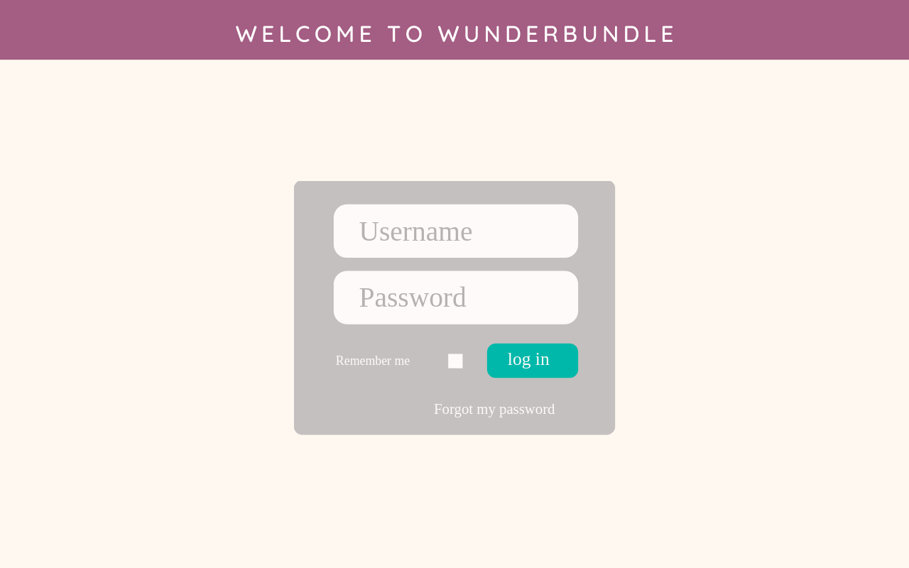
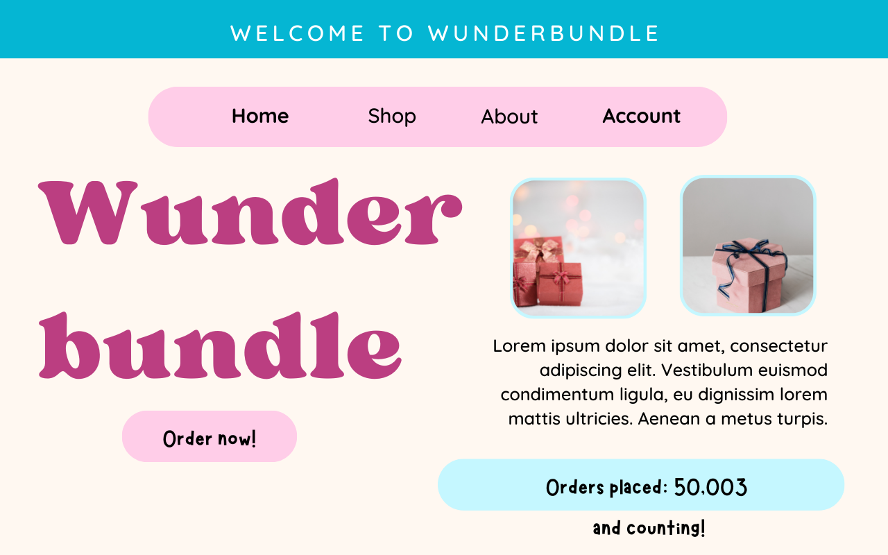
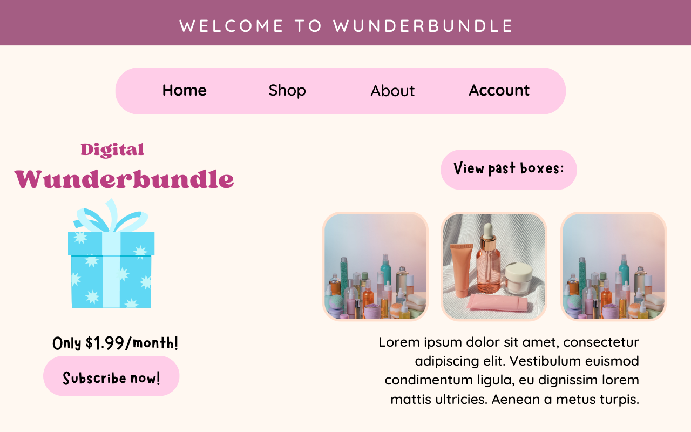
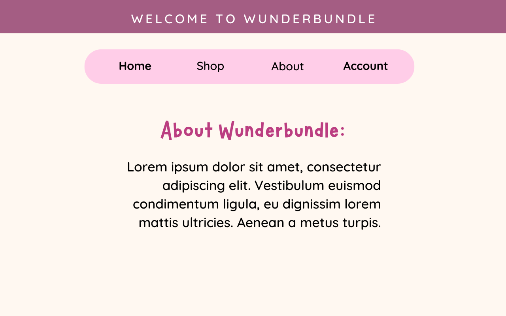
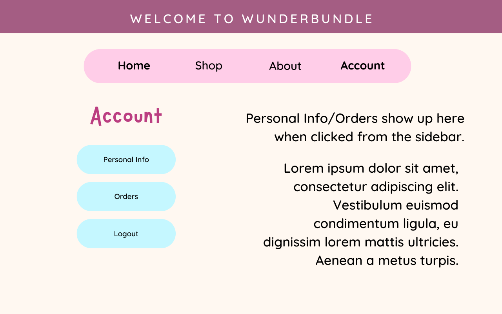

# Startup Docs

### My Pitch for Wunderbundles
There is a market for people who want to be surprised by unique products. Everyone knows the feeling of getting a gift from a friend on a birthday. It feels very special to unexpectedly get a gift versus buying something for yourself. This website sells "wunderbundles" that surprise you with digital surprise gifts!

### Key Features
This website is broken up into a login page, home page, shopping page, about page, and account page. Visitors will be able to create an account, make orders, and view their information.

### Implemented Tech
This website will implement authorization, databases, and websockets in the following ways:
1) Visitors will use a login page which will require authorization
2) Customer info and orders will be recorded in database
3) A websocket will display real-time completed orders on the homepage

### Images

